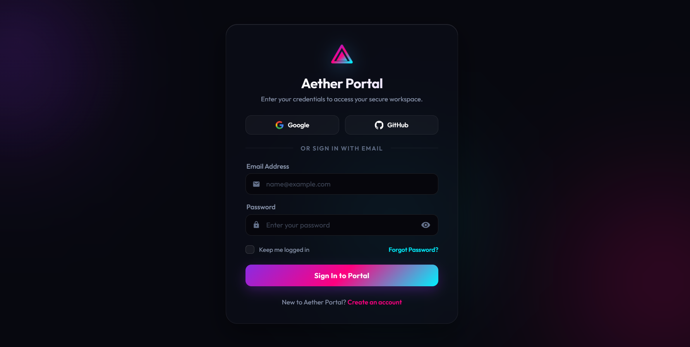
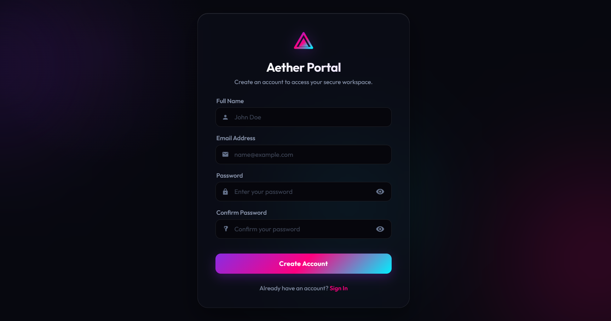

# 🔐 Login Page UI

A clean, responsive, and modern user interface for Authentication (Login and Signup). This project provides a ready-to-use template for web applications requiring a secure and stylish entry point.

## ✨ Features

- **Modern Design:** Clean and minimalistic aesthetic.
- **Responsive Layout:** Perfectly scales across desktop, tablet, and mobile devices.
- **Interactive Elements:** Smooth hover effects and CSS transitions.
- **Form Validation:** Basic client-side validation logic using JavaScript.
- **Multi-Page Setup:** Includes seamlessly connected Login (`index.html`) and Registration (`signup.html`) screens.

## 🛠️ Technologies Used

- **HTML5:** Semantic layout and structure.
- **CSS3:** Custom styling, responsive design, and animations.
- **JavaScript (Vanilla):** Dynamic interactions and basic form handling.

## 📂 Project Structure

```text
📦 Login Page UI
┣ 📜 index.html    # The main Login page
┣ 📜 signup.html   # The Registration/Signup page
┣ 📜 style.css     # Global stylesheet for layout and design
┗ 📜 app.js        # JavaScript logic for form validation and UI interactions
```

## 🚀 Getting Started

To run this project locally, simply clone the repository and open the HTML files in your browser. No build tools, package managers, or frameworks are required!

### Prerequisites
A modern web browser (Chrome, Firefox, Safari, Edge).

### Installation

1. **Clone the repository:**
   ```bash
   git clone https://github.com/VadsolaKishan/Login-Page-UI.git
   ```

2. **Navigate to the project directory:**
   ```bash
   cd "Login Page UI"
   ```

3. **Open the application:**
   Simply double-click on `index.html` to open it in your default web browser. Alternatively, if you are using VS Code, you can use the [Live Server extension](https://marketplace.visualstudio.com/items?itemName=ritwickdey.LiveServer) for real-time updates.

## 📸 Screenshots

> **Login Page**
> 

> **Signup Page**
> 

## 🤝 Contributing

Contributions, issues, and feature requests are always welcome! 
Feel free to check out the [issues page](https://github.com/VadsolaKishan/Login-Page-UI/issues) if you have any questions or want to contribute.

## 📄 License

This project is licensed under the [MIT License](https://opensource.org/licenses/MIT) - see the LICENSE file for details.

---
*Created with ❤️ by [Vadsola Kishan / Synent Technologies](https://github.com/VadsolaKishan)*
